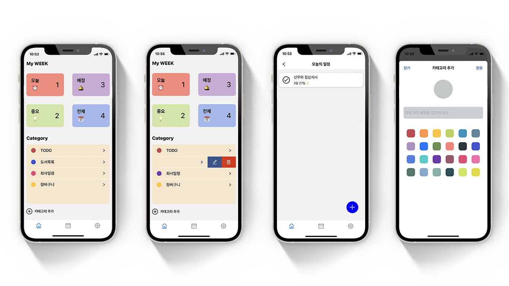
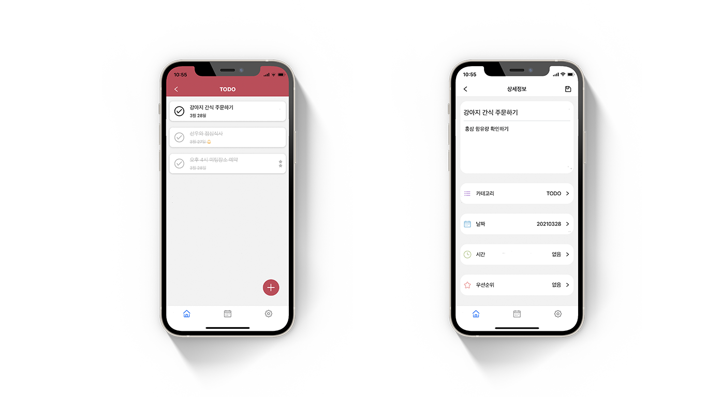
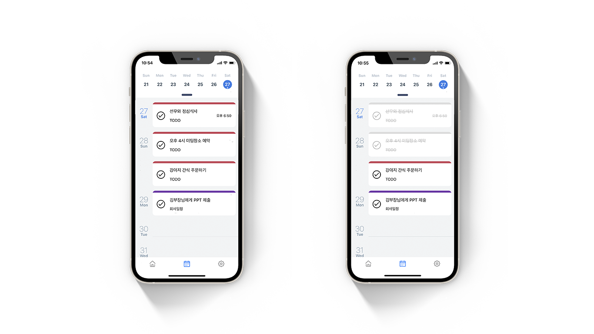

## 🎯 WEEK

TODO 와 Schedule 관리를 함께 할 수 있는 생산성 애플리케이션 입니다. React-Native를 사용하여 Android, ios 모두 구현했으며 Local DB로 Realm을 사용하였고 React-navigation을 사용하였습니다.

시간 순서, 업무의 중요도에 따라 일정을 분류할 수 있으며, 캘린더를 적용하여 효율적으로 TODO를 관리할 수 있고 빠르고 정확하게 TODO를 작성 하며 간단하게 편집도 할 수 있습니다.

[AppStore에서 어플을 확인 해보세요!](https://apps.apple.com/kr/app/week/id1568287922)

[PlayStore에서 어플을 확인 해보세요!](https://play.google.com/store/apps/details?id=com.week.todocalendar.app)

***

### 🎖 구현 기능

#### ✅ &nbsp; Category & Thema
 

크게 4가지 테마로 나뉘며 **"오늘", "예정", "중요", "전체**"로 해당 테마에서 작성한 TODO를 확인할 수 있으며 구별하기 쉽게 카테고리마다 색상을 설정할 수 있습니다. 그리고 **react-native-gesture-handler/Swipeable**을 사용하여 해당 카테고리에 Swipe 하면 언제든 수정과 삭제가 가능합니다.

#### ✅ &nbsp; TODO
 

FlatList를 활용하여 List를 만들었으며 날짜와 시간이 설정되어 있으면 내용 밑에 해당 날짜와 알람 아이콘을 추가하였고 중요도를 설정하면 TODO 우측에 확인할 수 있습니다. 우선도 와 카테고리 리스트는 **react-native-modal** 활용하여 직접 만들었습니다.

#### ✅ &nbsp; 상세보기 & 완료
 

해당 TODO를 클릭하면 상세보기가 나오는데 여기서 메모를 추가하고 내용과 카테고리 및 날짜, 시간, 우선순위를 변경할 수 있습니다.

#### ✅ &nbsp; Calendar 

**react-native-calendars** 의 Agenda를 활용하여 일정을 한눈에 보기 쉽게 구현하였으며 Calendar Tab에서 TODO의 일정을 확인할 수 있습니다. 그리고 다른 일정과 헷갈리지 않게 카테고리 생성 시 지정한 컬러를 TODO 상단에 적용함으로써 어떤 카테고리에 있는 일정인지 구별하기 쉽게 만들었습니다.  완료된 일정은 Calendar 또는 TODO_LIST에서 체크 아이콘을 클릭하면 일정이 완료됩니다.

***

### 📌 기술 스택
#### 💎 Front
- React-Native
- Redux
- Redus-Saga
- Realm
- Styled-Components

***