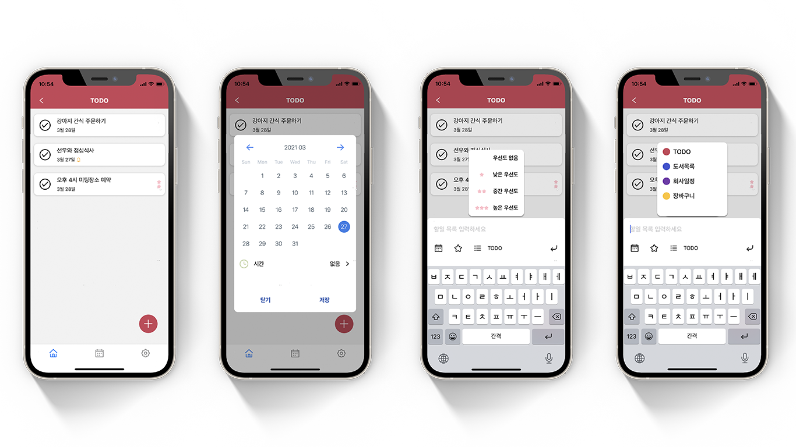

## 🎯 WEEK

To Do list 작성과 Schedule 관리를 함께 할 수 있는 생산성 어플리케이션 입니다.  React-Native를 사용하여 Android, ios 모두 구현 했으며 Local DB로 Realm을 사용했습니다.

시간 순서, 업무의 중요도에 따라 일정을 분류할 수 있으며, 기존의 To Do list와 달리 카테고리, 우선순위를 부여할 수 있는 기능을 구현하였습니다. 또한 알람 기능을 추가하여 생산성 어플리케이션으로서의 역할을 강화하였습니다.

※ 현재 기능개발이 완료된 상태이며 막바지 작업인 디자인 수정과 버그 수정을 한 후 4월 중으로 앱스토어, 플레이스토어에 출시 예정입니다.

***

### 🎖 구현 기능

#### ✅ &nbsp; Category & Thema
 

크게 4가지 테마로 "오늘", "예정", "중요", "전체"로 해당 테마에서 TODO를 확인할 수 있으며 구별하기 쉽게 카테고리마다 색상을 설정할 수 있고 해당 카테고리에 Swipe를 하면 언제든 수정과 삭제를 할 수 있습니다.

#### ✅ &nbsp; TODO
 

FlatList를 활용하여 TODO_LIST를 만들었으며 날짜와 시간이 설정되어 있으면 내용 밑에 날짜와 알람 아이콘을 추가하였고 중요도를 설정하면 TODO 우측에 확인할 수 있습니다. 우선도 와 카테고리 리스트는 Modal을 활용하여 직접 만들었습니다.

#### ✅ &nbsp; Detail & Clear
 

해당 TODO를 클릭하면 Detail 페이지가 나오며 여기서 메모를 추가하고 내용도 카테고리 및 날짜와 시간 우선순위를 변경할 수 있습니다.

#### ✅ &nbsp; Calendar && Weeks

**react-native-calendars** 의 Agenda를 활용하여 한눈에 보기 쉽게 구현하였으며 캘린더를 확인하여 TODO의 일정을 확인할 수 있습니다. 그리고 다른 일정과 헷갈리지 않게 카테고리 생성 시 지정한 컬러를 TODO 상단에 적용함으로써 어떤 카테고리에 있는 일정인지 구별하기 쉽게 만들었습니다. 

***

### 📌 기술 스택
#### 💎 Front
- React-Native
- Redux
- Redus-Saga
- Realm
- Styled-Components

***